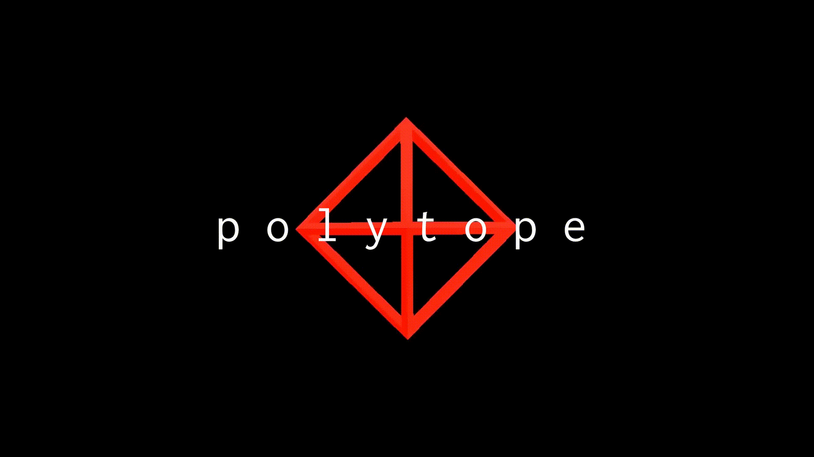

# polytope
POLYTOPE is a 2D action adventure puzzle platformer game that mixes interesting mechanics with a darkly humorous storyline.

# origins
I began working on the prototype of this game around February 2020, and now I am working on the final project as of January 2021. I intend to eventually release this game as a fully functioning product!

# GDD
Access the GDD [here](https://docs.google.com/document/d/1FcC4by6wSyDFr1duubdEXU-YGmhnCjn_4vJMXRqgV9k/edit?usp=sharing)

###### 2021 by Theo Stewart-Griffiths

